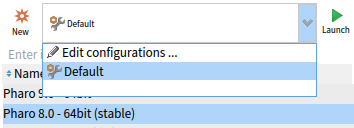
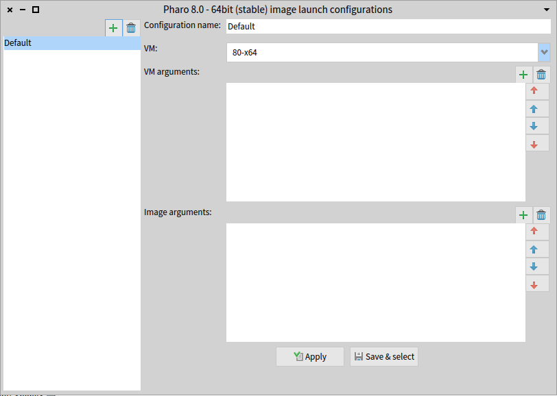

In order to launch Pharo images, Pharo Launcher needs some information. The most important one is: **Which VM to use?** Pharo Launcher can solve this problem for you by using the recommended VM for the Pharo version of the image to launch.

*Example: For a Pharo 8.0, 64-bit image, Pharo Launcher will use the stable 64-bit virtual machine of Pharo 8.*

With this information, Pharo Launcher generates a *Default* launch configuration that will be used to launch the image.

You could want to customize this Default configuration or create additional ones, by example, to use another VM (e.g. headless VM), or to give extra arguments to the virtual machine and / or to the image.
That's why, if you select the *Edit configurations ...* entry in the Launch configuration drop list (in the toolbar), Pharo Launcher will open a new window with the Launch configuration editor.

From this editor, you can:

* add/remove Launch configuration for the selected Pharo image,
* choose another VM than the one Pharo Launcher selected for you,
* add/remove arguments to the Virtual Machine,
* add/remove arguments to the image.

Clicking an **Save & select** will close the editor and select the edited Launch configuration in the Pharo Launcher toolbar, the ready to be launched.
