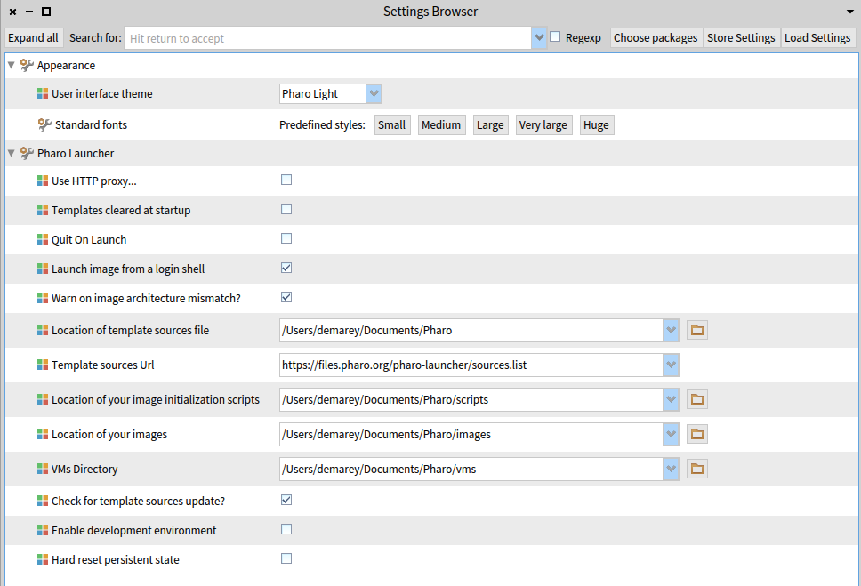

Pharo Launcher comes with a few settings you can customize.

**WARNING: Settings are only persisted by clicking on the "Store settings" button!** If you do not click on "Store settings", settings changes will only apply for the current Pharo Launcher session (i.e. until you quit Pharo Launcher).

## Network
* Use HTTP proxy ? If checked then the you will be able to set a port number and a server name. If unchecked, then no http proxy is used.

## Behavior
* Templates cleared at startup: When enabled, Launcher startup clears the Templates List. When disabled, Launcher startup retains the Templates List from last run.
* Quit on Launch: When enabled, Pharo Launcher quits when an image is launched. When disabled, Pharo Launcher stays alive when an image is launched.
* Warn on architecture mismatch? Get a warning when trying to launch an image with a different architecture than the Launcher (i.e. trying to launch a 32-bit image from Pharo Launcher 64-bit).
* Check for template sources update? Check regularly (each day) if Pharo Launcher Template official sources has an update available (needs internet access)

## Paths
* Location of the template sources file: Path to the directory that will contain Pharo Launcher template sources file.
* Template sources URL: URL for downloading the template list.
* Location of image initialization scripts: A directory where all your Pharo images initialization scripts will be saved (executed once at image creation).
* Location of images: A directory where all your Pharo images will be saved and launched.
* Virtual Machines directory: Path to the directory containing all the VMs to launch your Pharo images.

WARNING: You must have the read/write rights on folders.The path might need to escape some whitespace characters.

## Danger zone
Use these options only if you know what you are doing!

* Enable development environment: closes Pharo Launcher UI and restore Pharo IDE for development purposes.
* Hard reset persistent state: One-shot action. Will put nil in all class variables of Pharo Launcher packages and restart the UI.
